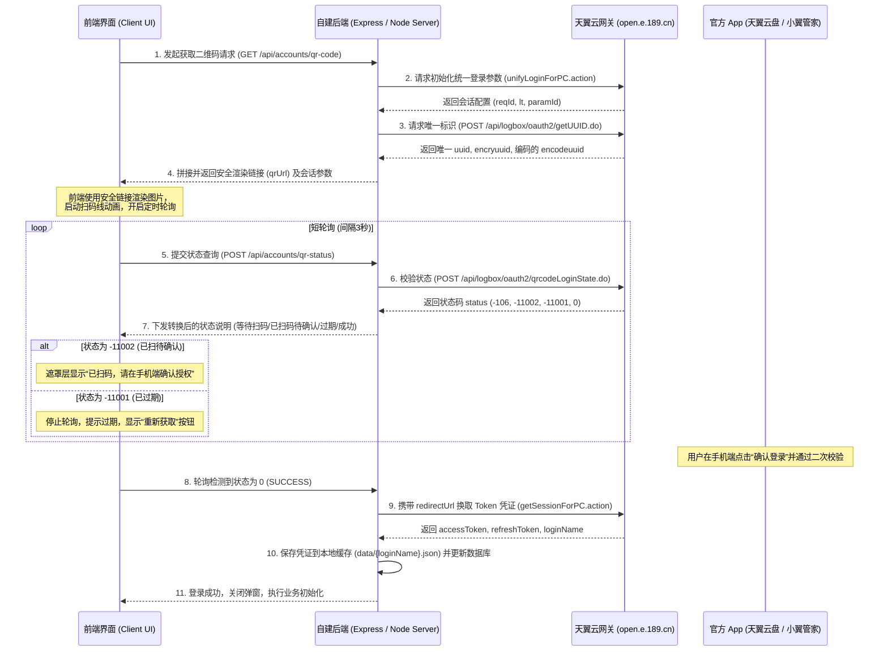

# 天翼云盘扫码登录（OAuth 2.0）开发接入与流程参考指南

随着中国电信天翼账号安全网关的升级，传统的基于 Cookie (如 `SSON` 等旧版 Session 凭证) 的第三方认证极易因为官方风控校验、会话超时或官方改版而频频失效。天翼云盘官方 App 扫码授权（基于统一 OAuth 2.0 流程）是目前最为安全、长久稳定、免密码且零维护成本的登录认证方案。

本指南详细剖析了天翼云盘扫码登录的完整交互时序、底层 API 规约、后端路由设计以及前端高交互 UI 实现，旨在为其他项目接入天翼云盘（或中国电信统一登录中心）扫码认证提供标准参考。

---

## 1. 业务交互时序图

天翼云盘扫码登录的底层是基于**中国电信统一账号认证中心**的授权流程，核心步骤包括：获取会话标识 -> 获取二维码图片 -> 客户端状态轮询 -> 换取 Token 令牌 -> 完成会话注册。



---

## 2. 底层接口技术规约

### 2.1 获取会话配置
在向电信网关请求 UUID 前，必须请求 PC 登录入口页面，以初始化该次登录会话的临时参数（包括 `reqId` 和 `lt` 等）。

*   **请求 URL**: `https://cloud.189.cn/api/portal/unifyLoginForPC.action`
*   **请求方法**: `GET`
*   **查询参数**:
    *   `appId`: 固定为 `8025431004` (天翼云盘官方 AppID)
    *   `clientType`: 固定为 `10020`
    *   `returnURL`: 官方重定向页，如 `https://m.cloud.189.cn/zhuanti/2020/loginErrorPc/index.html`
    *   `timeStamp`: 当前毫秒时间戳
*   **返回格式**: HTML 页面
*   **提取内容**: 从 HTML 正文中通过正则表达式提取以下关键会话参数：
    ```javascript
    const captchaToken = html.match(/'captchaToken' value='(.+?)'/)[1];
    const lt = html.match(/lt = "(.+?)"/)[1];
    const paramId = html.match(/paramId = "(.+?)"/)[1];
    const reqId = html.match(/reqId = "(.+?)"/)[1];
    ```

### 2.2 请求 UUID 唯一标识
获取用于该次扫码登录的二维码凭证 UUID 信息。

*   **请求 URL**: `https://open.e.189.cn/api/logbox/oauth2/getUUID.do`
*   **请求方法**: `POST`
*   **请求头**:
    *   `Referer`: `https://open.e.189.cn`
    *   `User-Agent`: (必须填入标准的 PC 浏览器 User-Agent，防爬虫过滤)
*   **表单参数**:
    *   `appId`: 固定为 `8025431004`
*   **返回 JSON**:
    ```json
    {
      "result": 0,
      "msg": "操作成功",
      "uuid": "https://open.e.189.cn/api/account/qrClinentLogin.do?paras=new_uuid%3D...",
      "encryuuid": "D4F61A0B1CEC61...",
      "encodeuuid": "https%3A%2F%2Fopen.e.189.cn%2Fapi%2Faccount%2F..."
    }
    ```

### 2.3 获取二维码图片
这是很多开发者容易踩坑的地方。天翼账号使用特殊的图片服务器，不能直接将 `uuid` 作为二维码内容在前端渲染，而必须通过如下专用的图片获取接口。

*   **请求 URL**: `https://open.e.189.cn/api/logbox/oauth2/image.do`
*   **请求方法**: `GET`
*   **查询参数**:
    *   `uuid`: 必须是 **URL 编码后的 `uuid`**（即返回包中的 `encodeuuid`，或者对 `uuid` 执行 `encodeURIComponent` 的结果）。如果直接传未编码的 URL，服务端会返回 404。
    *   `REQID`: 填入前面初始化会话获取的 `reqId`。
*   **返回格式**: `image/jpeg` 图片流（可以直接设为 HTML `` 标签的 `src` 地址）。

### 2.4 轮询扫码状态
用于以短轮询方式（建议每 3 秒一次）监控用户在手机端的扫码与确认状态。

*   **请求 URL**: `https://open.e.189.cn/api/logbox/oauth2/qrcodeLoginState.do`
*   **请求方法**: `POST`
*   **请求头**:
    *   `Referer`: `https://open.e.189.cn`
    *   `Reqid`: 填入前面获取的 `reqId`
    *   `lt`: 填入前面获取的 `lt`
*   **表单参数**:
    *   `appId`: 固定为 `8025431004`
    *   `clientType`: 固定为 `10020`
    *   `returnUrl`: 同初始化 `ReturnURL`
    *   `paramId`: 填入前面获取的 `paramId`
    *   `uuid`: 填入原始的 `uuid` (未编码)
    *   `encryuuid`: 填入原始的 `encryuuid`
    *   `date`: 格式为 `yyyy-MM-dd HH:mm:ss.SSS`（例如 `2026-06-01 10:15:20.123`）
    *   `timeStamp`: 当前时间戳
*   **返回 JSON**:
    ```json
    {
      "status": -106,
      "redirectUrl": ""
    }
    ```
*   **状态码字典**:
    *   `-106`: 等待扫码中。
    *   `-11002`: 已扫码，等待手机端点击“确认登录”。
    *   `-11001`: 二维码已失效过期（需要提醒用户刷新）。
    *   `0`: 扫码并确认成功！此时会返回 `redirectUrl` 用以换取最终的会话令牌。

### 2.5 换取 Token 凭证
在 `status === 0` 时，使用返回的 `redirectUrl` 向网关换取最终用于文件传输和接口调用的授权 Token。

*   **请求 URL**: `https://api.cloud.189.cn/getSessionForPC.action`
*   **请求方法**: `POST`
*   **查询参数**:
    *   `appId`: `8025431004`
    *   `clientType`: `TELEPC`
    *   `version`: `6.2`
    *   `channelId`: `web_cloud.189.cn`
    *   `redirectURL`: 扫码成功时接口返回的 `redirectUrl`
*   **返回 JSON**:
    ```json
    {
      "accessToken": "ACCESS_TOKEN_STRING...",
      "refreshToken": "REFRESH_TOKEN_STRING...",
      "loginName": "手机号/别名...",
      "keepAlive": 1
    }
    ```
    *注：`accessToken` 用于每次请求的鉴权头；`refreshToken` 用于在 accessToken 到期时静默续期。*

---

## 3. 后端服务集成参考 (Node.js/Express)

在服务侧设计两个路由，分别用来提供二维码数据和短轮询结果，同时妥善保存 Token 信息。

```javascript
const express = require('express');
const { CloudAuthClient } = require('./vender/cloud189-sdk'); // SDK封装
const fs = require('fs').promises;
const path = require('path');
const app = express();

app.use(express.json());

// 接口一：获取二维码渲染地址及轮询载荷
app.get('/api/accounts/qr-code', async (req, res) => {
    try {
        const authClient = new CloudAuthClient();
        
        // 1. 获取网关临时 UUID 信息与会话标识
        const qrData = await authClient.getQRCode();
        
        // 2. 拼接能够直接在  渲染的图片获取链接
        // 核心：uuid 必须经过 encodeURIComponent 编码，并携带 reqId 保持会话一致
        const qrImageUrl = `https://open.e.189.cn/api/logbox/oauth2/image.do?uuid=${encodeURIComponent(qrData.uuid)}&REQID=${qrData.reqId}`;
        
        res.json({
            success: true,
            data: {
                ...qrData,
                qrUrl: qrImageUrl // 供前端  标签直接绑定显示
            }
        });
    } catch (error) {
        console.error('[扫码登录] 获取二维码失败:', error);
        res.status(500).json({ success: false, error: error.message });
    }
});

// 接口二：状态轮询与凭证落盘
app.post('/api/accounts/qr-status', async (req, res) => {
    try {
        const authClient = new CloudAuthClient();
        const qrData = req.body; // 包含 uuid, encryuuid, reqId, lt, paramId
        
        // 1. 提交至网关检测扫码状态
        const qrStatus = await authClient.checkQRCodeStatus(qrData);
        
        // 2. 登录成功 (status === 0)
        if (qrStatus.status === 0) {
            // 换取 AccessToken
            const loginToken = await authClient.getSessionForPC({ redirectURL: qrStatus.redirectUrl });
            const loginName = loginToken.loginName;
            
            // 拼接并缓存凭证到本地 json 文件，以便其他服务异步读取进行静默免密刷新
            const tokenData = {
                accessToken: loginToken.accessToken,
                refreshToken: loginToken.refreshToken,
                expiresIn: Date.now() + 6 * 24 * 60 * 60 * 1000 // 6天有效期
            };
            
            const tokenFilePath = path.join(__dirname, 'data', `${loginName}.json`);
            await fs.mkdir(path.dirname(tokenFilePath), { recursive: true });
            await fs.writeFile(tokenFilePath, JSON.stringify(tokenData, null, 2), 'utf-8');
            
            // 3. 执行系统内数据库记录写入，挂载天翼账户...
            // writeToDatabase(loginName, ...);
            
            return res.json({
                success: true,
                status: 0,
                data: { username: loginName }
            });
        }
        
        // 3. 其他非成功状态（等待扫码、已扫待确、已过期等）直接透传
        res.json({
            success: true,
            status: qrStatus.status
        });
    } catch (error) {
        console.error('[扫码登录] 检查状态失败:', error);
        res.status(500).json({ success: false, error: error.message });
    }
});
```

---

## 4. 前端交互 UI 设计与状态控制

为用户提供一个高品质、动画流畅且状态明确的扫码弹框是保障用户体验的关键。

### 4.1 HTML 结构 (选项卡与遮罩)
```html
<div class="login-tabs">
    <button onclick="switchTab('pass')">账号密码</button>
    <button onclick="switchTab('qr')">扫码登录</button>
</div>

<!-- 扫码面板 -->
<div id="qr-login-panel" style="display:none;">
    <div class="qr-code-container">
        <!-- 紫色渐变扫描激光线 -->
        <div class="qr-scanner-laser" id="laser"></div>
        <!-- 二维码图像 -->
        
        
        <!-- 高斯模糊状态遮罩 -->
        <div id="qr-status-mask" style="display:none;">
            <span id="mask-icon">🔔</span>
            <span id="mask-text">已扫码，请在手机端确认</span>
            <button id="refresh-btn" onclick="startQRCodeFlow()">重新获取</button>
        </div>
    </div>
    <div id="status-message">正在获取二维码...</div>
</div>
```

### 4.2 CSS 样式 (呼吸扫描线与模糊滤镜)
```css
.qr-code-container {
    position: relative;
    width: 200px;
    height: 200px;
    border: 1px solid var(--border-color);
    border-radius: 8px;
    overflow: hidden;
}

/* 从上到下的紫色渐变呼吸扫描激光线 */
.qr-scanner-laser {
    position: absolute;
    width: 100%;
    height: 3px;
    background: linear-gradient(to right, transparent, #a855f7, transparent);
    animation: scanAnim 2.5s infinite linear;
    z-index: 10;
}

@keyframes scanAnim {
    0% { top: 0%; opacity: 0; }
    10% { opacity: 1; }
    90% { opacity: 1; }
    100% { top: 100%; opacity: 0; }
}

/* 状态模糊遮罩 */
#qr-status-mask {
    position: absolute;
    top: 0; left: 0; width: 100%; height: 100%;
    background: rgba(0, 0, 0, 0.65);
    backdrop-filter: blur(4px); /* 高斯模糊效果 */
    display: flex;
    flex-direction: column;
    align-items: center;
    justify-content: center;
    color: white;
    z-index: 20;
}
```

### 4.3 JavaScript 轮询生命周期控制
在切换 Tab 或关闭弹窗时，必须**立即销毁轮询定时器**，避免内存溢出或后台请求挂起。

```javascript
let qrInterval = null;
let activeQRData = null;

async function startQRCodeFlow() {
    stopQRCodeFlow(); // 确保安全清理
    
    const qrImg = document.getElementById('qr-image');
    const statusMsg = document.getElementById('status-message');
    const statusMask = document.getElementById('qr-status-mask');
    
    qrImg.src = '';
    qrImg.style.filter = 'blur(6px)'; // 未加载成功时呈虚化状态
    statusMsg.innerText = '正在获取二维码...';
    statusMask.style.display = 'none';

    try {
        const res = await fetch('/api/accounts/qr-code');
        const result = await res.json();
        
        if (result.success) {
            activeQRData = result.data;
            qrImg.src = result.data.qrUrl;
            qrImg.onload = () => {
                qrImg.style.filter = 'none'; // 图片加载成功，去除模糊
            };
            statusMsg.innerText = '请使用天翼云盘 App 扫码登录';
            
            // 启动 3 秒一次的短轮询检测
            qrInterval = setInterval(pollStatus, 3000);
        } else {
            statusMsg.innerText = '生成二维码失败，请重试';
        }
    } catch (e) {
        statusMsg.innerText = '网络异常，生成二维码失败';
    }
}

function stopQRCodeFlow() {
    if (qrInterval) {
        clearInterval(qrInterval);
        qrInterval = null;
    }
    activeQRData = null;
}

async function pollStatus() {
    if (!activeQRData) return;
    
    try {
        const res = await fetch('/api/accounts/qr-status', {
            method: 'POST',
            headers: { 'Content-Type': 'application/json' },
            body: JSON.stringify(activeQRData)
        });
        const result = await res.json();
        
        if (result.success) {
            const mask = document.getElementById('qr-status-mask');
            const maskText = document.getElementById('mask-text');
            const maskIcon = document.getElementById('mask-icon');
            const refreshBtn = document.getElementById('refresh-btn');
            
            if (result.status === 0) {
                // 成功：清理轮询，通知界面刷新，关闭弹窗
                stopQRCodeFlow();
                alert('登录成功！');
                location.reload();
            } else if (result.status === -11002) {
                // 已扫码未确认
                mask.style.display = 'flex';
                maskIcon.innerText = '⏳';
                maskText.innerText = '已扫码，请在手机端确认授权';
                refreshBtn.style.display = 'none';
            } else if (result.status === -11001) {
                // 二维码过期
                stopQRCodeFlow();
                mask.style.display = 'flex';
                maskIcon.innerText = '⚠️';
                maskText.innerText = '二维码已失效';
                refreshBtn.style.display = 'block'; // 呈现刷新按钮
            }
        }
    } catch (e) {
        console.error('轮询请求失败:', e);
    }
}
```

---

## 5. 项目落地关键避坑总结

1.  **UUID 二维码图片 404 错误**：  
    调用网关 `image.do` 渲染图片时，传入的 `uuid` 字段内容由于带有多层嵌套参数（包括 `paras` 字段下的 `%7C` 等符号），必须使用 `encodeURIComponent()` 编码。漏掉此编码是造成二维码无法正常展示的最常见元凶。
2.  **DNS & Proxy 环境连通性**：  
    天翼云认证网关 `open.e.189.cn` 在非大陆地区 IP 或特定代理环境下，可能会被官方 DNS 轮询解析到被阻断的 IP，引发超时。建议 SDK 层支持代理服务器（HttpProxyAgent）注入，并将 Got 客户端超时参数至少缩短为 `10000ms`（10 秒），防止后台服务在超时严重时卡死主线程。
3.  **Token 定时自动刷新策略**：  
    扫码获得的授权凭证包含 `accessToken` (有效天数较短) 和 `refreshToken` (有效期长达数周)。后台服务应配置 Cron 定时任务，在检测到 expiresIn 即将过期时（例如剩余 12 小时），自动调用 `refreshToken.do` 接口静默刷新 Token，不需要用户重新扫码。
