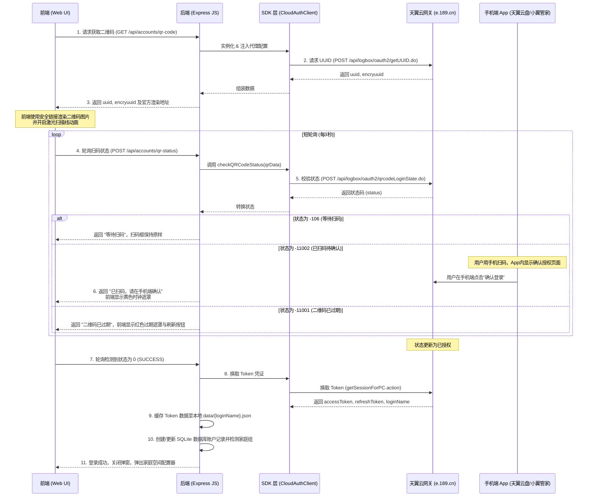

# 天翼云盘扫码登录设计与实现文档

由于传统的 Cookie 登录模式（如统一单点登录 SSON 等）因电信官方网关频繁升级、风控策略调整、以及多维会话参数校验（如 `JSESSIONID`、`apm_key`）的限制，极易出现失效或登录失败。为了提供更安全、稳定、零维护成本的账户授权能力，本系统在 `concept` 分支上成功实现并集成了 **天翼云盘扫码登录（QR Code Login）**。

---

## 1. 方案时序与接口分析

扫码登录底层基于电信天翼账号统一认证中心的 OAuth 2.0 授权码认证流程，其具体交互逻辑如下：



### 1.1 核心网络端点说明

1.  **获取 UUID 标识**
    *   **URL**: `https://open.e.189.cn/api/logbox/oauth2/getUUID.do`
    *   **Method**: `POST`
    *   **参数**: `appId=8025431004` (天翼云统一 App 授权 ID)
2.  **获取二维码图片**
    *   **URL**: `https://open.e.189.cn/api/logbox/oauth2/image.do?uuid=${encodeURIComponent(uuid)}&REQID=${reqId}`
    *   **Method**: `GET`
3.  **轮询扫码状态**
    *   **URL**: `https://open.e.189.cn/api/logbox/oauth2/qrcodeLoginState.do`
    *   **Method**: `POST`
    *   **状态码定义**:
        *   `0`: 登录成功，并提供 `redirectUrl` 用以换取会话凭证。
        *   `-106`: 等待扫码。
        *   `-11002`: 已扫码，等待手机端点击确认。
        *   `-11001`: 二维码已失效过期。

---

## 2. 架构设计与本地代码改造

### 2.1 依赖库重构 (解耦 Submodule)
由于本地对 `vender/cloud189-sdk` 进行了深度的定制化改动，为了避免在 CI 编译环境中（如 GitHub Actions）因为无法拉取 submodule 未推送的本地提交而报错，我们**解除了 Git 子模块关联，将其转换为普通目录直接提交入库**。

### 2.2 核心代码调整说明

#### 1. SDK 代理与超时调整 (`vender/cloud189-sdk/src/`)
*   **[CloudClient.ts](file:///d:/MyProjects/cloud189-auto-save%20-%20concept/vender/cloud189-sdk/src/CloudClient.ts)**:
    解决代码合并冲突，完美保留了代理对象构造、DNS 优先 IP 版本强制解析（`dnsLookupIpVersion`）以及 10 秒超时校验，并添加了 `onQRCodeReady`/`qrLoginOptions` 扫码选项。
*   **[CloudAuthClient.ts](file:///d:/MyProjects/cloud189-auto-save%20-%20concept/vender/cloud189-sdk/src/CloudAuthClient.ts)**:
    补齐了代理代理实例注入（`setProxy`）和 10s 超时配置。防止扫码验证在企业内网或国外科学网络环境下发生超时或挂起。
*   **[types.ts](file:///d:/MyProjects/cloud189-auto-save%20-%20concept/vender/cloud189-sdk/src/types.ts)**:
    将 `CacheQuery` 中的加密解密校验字段变为可选，修复了 TS 严格模式下的类型缺失编译错误。

#### 2. 后端服务端改造 (`src/index.js`)
*   **`GET /api/accounts/qr-code`**: 实例化 `CloudAuthClient` 获取扫码 UUID，并输出图片链接供前端调用。
*   **`POST /api/accounts/qr-status`**: 处理单次短轮询。
    *   在返回 `status === 0` 成功时，后台拉取 `TokenSession`；
    *   将包含过期时间的 Token 写入到系统持久化根目录 `./data/${loginName}.json` 中，以便 `FileTokenStore` 无密码时也可以完美完成认证。
    *   自动生成数据库账号记录，并调用家庭接口自动识别和挂载该账号下的家庭组空间。

#### 3. 前端界面改造 (`src/public/`)
*   **[index.html](file:///d:/MyProjects/cloud189-auto-save%20-%20concept/src/public/index.html)**:
    在“添加账户”弹窗中通过切换 Tab 呈现不同的登录面板，并在扫码面板中预留动画激光线和磨砂状态 Mask。
*   **[css/modal.css](file:///d:/MyProjects/cloud189-auto-save%20-%20concept/src/public/css/modal.css)**:
    添加了扫码专属视觉样式。利用 `@keyframes scanAnim` 绘制从上到下扫过的紫色渐变激光线，并为已扫码/过期状态提供动感高斯模糊遮罩效果。
*   **[js/accounts.js](file:///d:/MyProjects/cloud189-auto-save%20-%20concept/src/public/js/accounts.js)**:
    实现扫码的定时轮询逻辑（3秒间隔），在关闭弹窗或切换 Tab 时自动销毁定时器释放连接，在扫码成功后直接刷新列表并无缝拉起家庭空间目录选择器。

---

## 3. 部署与运维手册

### 3.1 本地编译
在根目录下运行以下命令，验证 TypeScript 编译无错，并将静态资源复制同步到 dist 运行目录下：
```bash
# 运行 TypeScript 编译
npm run build

# 复制静态资源 (Windows PowerShell)
Copy-Item -Path "src/public" -Destination "dist" -Recurse -Force
```

### 3.2 Docker 镜像生成
主项目推送后，GitHub Actions 上的 `Build and Push to GHCR` 工作流会自动捕获 `concept` 分支的提交，自动执行 Docker 镜像多平台构建并推送到 GHCR：
*   **镜像地址**: `ghcr.io/ymting/my-cloud189-auto-save:concept-latest`

### 3.3 凭证维护与离线机制
*   **缓存位置**: 扫码用户的 OAuth Token 存储在容器持久化目录 `/home/data/${username}.json` 内。请确保在部署容器时正确挂载了 `/home/data` 目录，否则容器重建后扫码登录态将丢失。
*   **静默续期**: SDK 内部提供定时自动刷新机制。只要您的天翼云盘手机端没有安全踢出设备，该系统将每隔数日自动静默刷新 Token，不需要手动二次扫码。
*   **失效通知**: 若发生手机端解绑导致 `refreshToken` 失效，转存引擎报错，请关注推送通知（如 Telegram/企业微信），根据通知内的账户警报重新登录 Web 控制台扫码绑定。
